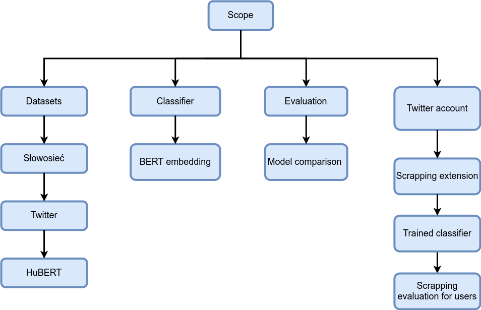

[13.12.2020]  
[Erdem, Mazurek, Rarus]  
**[POLEMIC]**

Full Project Proposal: <b> [POLish EMotIons Classifier] </b> 

**Background**  

The polish language lacks large quantities of texts representing certain human emotions, therefore training an accurate classifier is problematic. We face this issue by combining the dataset of 4211 tweets annotated by 31 annotators with weakly supervised datasets. We plan to improve the quality of classification, especially on the minority classes. 
By combining bigger data sources we aim to train The First Polish Classifier of Emotions in Text Data.

**Scientific/technological questions of your project**  

- How to obtain the additional datasets?
- How to train a classifier with weakly supervised data?
- How much weakly-supervised data can improve the model performance on the validation dataset?

**Objectives of the project** (according to [[1]](http://examples.yourdictionary.com/examples-of-measurable-goals-and-objectives.html
))

Improved F1 macro, when compared to the base dataset
1 Chrome extension published in the Chrome Web Store

**The final product of the project**  

Trained classifier in the form of an open-source project on Github
Twitter scraper chrome extension, which can be used to annotate emotions in the user’s tweets

**Scope**  

**Data**  
Dataset annotated by students
Dataset generated from “słowosieć” (based on emotion annotation)
Dataset generated from tweets (based on annotations from “słowosieć”)
Dataset generated by HuBERT

**Timeframe** [[2]](https://www.projectinsight.net/project-management-basics/project-management-schedule).  

|  	| Task | Start and End Dates |
| ---- | ---- | ---- |
| Phase One | “Słowosieć” dataset, base classifier|  18/12/2020 |
| Phase Two | Evaluation, Model comparision| 21/12/2020 |
| Phase Three | Model retrained at HuBert and Twitter datasets, Twitter extension, Trained classifier | 25/01/2021 |

**Key Stakeholders**

| 	|  Name |
| --- | --- |
| End Client | Polish Data Science community |
| Possible sponsor | Brand 24 |
| Project manager | Kemal Erdem |

**Monitoring and Evaluation of Project Progress**  

The project should be evaluated based on progress through the previously defined project’s scope.

**The scientific method for evaluation of how good is your solution/analysis/service**  

F1 macro on emotion classification

**References**  

[https://github.com/Separius/awesome-sentence-embedding](https://github.com/Separius/awesome-sentence-embedding)

[huggingface/transformers: 🤗Transformers: State-of-the-art Natural Language Processing for Pytorch and TensorFlow 2.0.](https://github.com/huggingface/transformers) - Sentence embedding using HuBERT

Data scrapping extension - [React](https://reactjs.org/)

Application and visualization - [ReactJS](https://reactjs.org/) 
