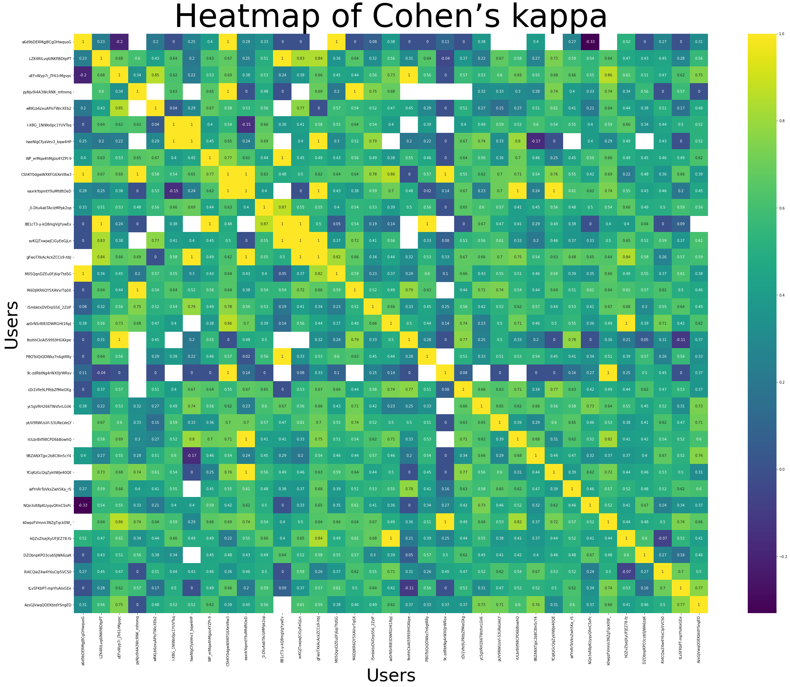
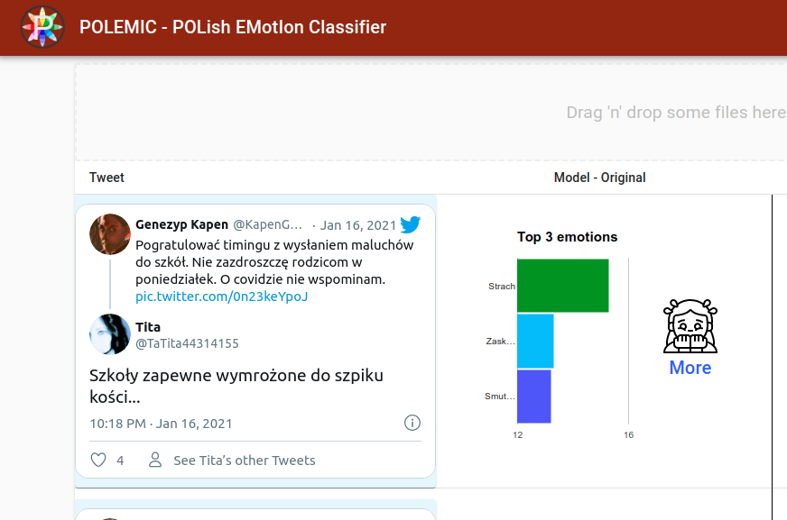

# POLEMIC 
**POL**ish **EM**ot**I**ons **C**lassifier


### How to get repo

Because repository is using submodules we have to download those submodules as well while clonning:

```shell
git clone --recurse-submodules https://github.com/SMAPWr/project-polish-emotions-classifier.git
```

### Quickstart

- Run from the main directory:
```shell
docker-compose up
```

- Copy token from console
- Go to `localhost:8001` and enter copied token to access notebooks
- Run `work/EDA-WUST-2k20-twitter-annotations.ipynb`
- Run `work/Create embedded train and test dataset.ipynb`
- Run `work/Classifier model.ipynb`

Baseline classifier results:
```
              precision    recall  f1-score   support

   neutralne       0.80      0.93      0.86       518
 oczekiwanie       0.20      0.07      0.11        28
      podziw       0.62      0.50      0.55        52
      radosc       0.52      0.41      0.46        83
      smutek       0.21      0.15      0.18        20
      strach       0.00      0.00      0.00        13
      wstret       0.11      0.08      0.10        24
 zaskoczenie       0.40      0.17      0.24        12
       zlosc       0.64      0.60      0.62        93

    accuracy                           0.72       843
   macro avg       0.39      0.32      0.35       843
weighted avg       0.67      0.72      0.69       843
```

### Run DB composer (for "slowosiec" Dataset creation only)

```shell
docker-compose -f slowosiec/docker-compose.yaml up
```

## Datasets

Dataset is manually annotated by 35 accounts (31 people) and achieves weighted **Cohen's kappa coefficient** of **0.51**. (Annotation analysis avaiable on [https://github.com/burnpiro/twitter_annotator_user_analysis](https://github.com/burnpiro/twitter_annotator_user_analysis))



#### "Slowosiec" dataset

Dataset is available in `./data/slowosiec_data.json.gz`. To extract it run (put a correct path base on your location, this path is from the notebook):
```python
import pandas as pd
df1 = pd.read_json('../data/slowosiec_data.json.gz', compression='gzip')
```

#### "Slowosiec" dataset with "neutral"

Dataset is available in `./data/slowosiec_all_data.json.gz`. To extract it run (put a correct path base on your location, this path is from the notebook):

```python
import pandas as pd
df1 = pd.read_json('../data/slowosiec_all_data.json.gz', compression='gzip')
```

## Standalone App

You can run standalone app by executing:

```shell
docker-compose -f application/docker-compose.yaml up --build
```

For more information visit [Wiki Page](https://github.com/SMAPWr/project-polish-emotions-classifier/wiki/Standalone-Application)



## Chrome Extension

There is an extension which allows user to extract data from twitter's wall. To build extension and use dev version please follow instruction on [POLEMIC Extension Wiki Page](https://github.com/SMAPWr/project-polish-emotions-classifier/wiki/Chrome-Extension)

Currently, extension is published into Chrome Web Store:
[https://chrome.google.com/webstore/detail/polemic/amohljmlgkapaaplajmicnbegfheolae](https://chrome.google.com/webstore/detail/polemic/amohljmlgkapaaplajmicnbegfheolae)

#### Usage

To use the extension just go to [https://twitter.com](https://twitter/com), login and on click extension icon . It's going to extract data from your wall and generate `.json` file which can be used as an input for POLEMIC model.

There is an [Instruction Video](https://www.youtube.com/watch?v=3VIkQ7kCEXI) on how to generate input file for model.

# Phase 1 (18/12/2020)

Derivables:
- “Słowosieć” dataset
- base classifier

What was achieved:
- ...


# Phase 2 (21/12/2020)

Derivables:
- Evaluation, Model comparision

What was achieved:
- ...


# Phase 3 (25/01/2020)

Derivables:
- Model retrained at HuBert and Twitter datasets, 
- Twitter extension, 
- Trained classifier

What was achieved:
- ...
