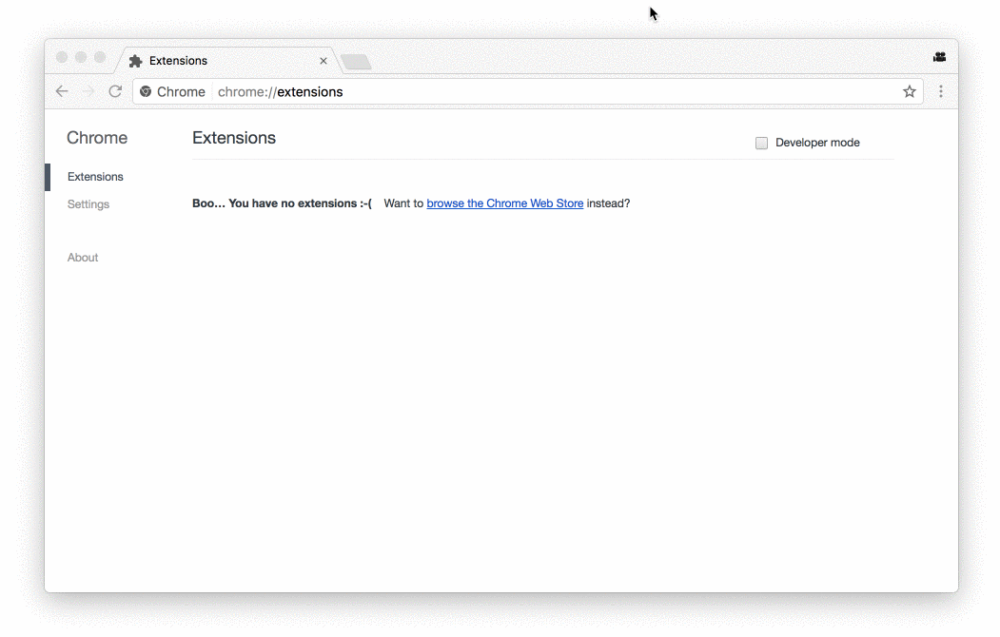

# POLEMIC - chrome extension

## Build using Docker

```shell
docker-compose -f {path_to_extension_folder}docker-compose.yaml up --build
```

## Build using NPM

Go to `./extension` directory ad run:
```shell
npm run build:prod
```

Extension should be build into `extension/dist` directory. You can load extension in chrome manually (select your `dist` folder):



Or you can publish this extension in [Chrome Web Store](https://chrome.google.com/webstore/category/extensions) though [Chrome Developer Dashboard](https://chrome.google.com/webstore/devconsole)